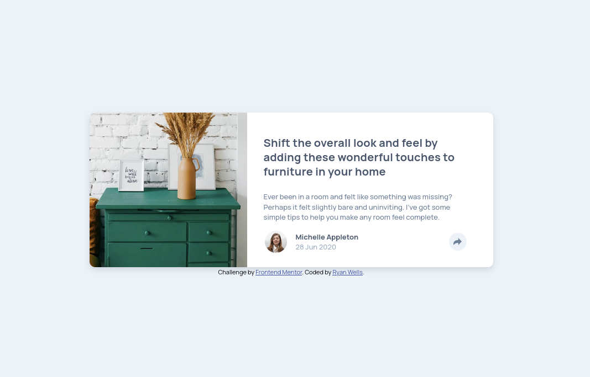

# Frontend Mentor - Article preview component solution

This is a solution to the [Article preview component challenge on Frontend Mentor](https://www.frontendmentor.io/challenges/article-preview-component-dYBN_pYFT). Frontend Mentor challenges help you improve your coding skills by building realistic projects. 

## Table of contents

- [Overview](#overview)
  - [The challenge](#the-challenge)
  - [Screenshot](#screenshot)
  - [Links](#links)
- [My process](#my-process)
  - [Built with](#built-with)
  - [What I learned](#what-i-learned)
  - [Continued development](#continued-development)
  - [AI Collaboration](#ai-collaboration)
- [Author](#author)

## Overview

### The challenge

Users should be able to:

- View the optimal layout for the component depending on their device's screen size
- See the social media share links when they click the share icon

### Screenshot



### Links

- Solution URL: [GitHub](https://github.com/ryanwells-rwc/article-preview-component)
- Live Site URL: [Netlify](https://inquisitive-bonbon-299220.netlify.app/)

## My process

### Built with

- Semantic HTML5 markup
- SASS
- Flexbox
- CSS Grid
- Mobile-first workflow

### What I learned

I learned how to create an overlay that slides into view when the user 
clicks the share icon. I also learned how to create a caption with an arrow 
at the bottom.

```css
      .overlay-layer {
  position: absolute;
  top: -$size-800;
  left: 50%;
  transform: translateX(-50%);
  width: 248px;
  height: 55px;
  background-color: $grey-900;
  border-radius: 10px;
  display: flex;
  justify-content: center;
  align-items: center;

  &::after {
    content: '';
    position: absolute;
    bottom: -50%;
    left: 50%;
    transform: translateX(-50%);
    border-width: 17px;
    border-style: solid;
    border-color: $grey-900 transparent transparent transparent;
  }
}
```

### Continued development

In the future, I'd like to get a better grasp of absolute and relative 
positioning, and how they can be used to anchor various elements.

### AI Collaboration

- I used Junie from the JetBrains AI team to help me with the CSS.
- Junie helped me to come up with solutions to some CSS positioning problems.
- Setting up Junie to work off of the instructions in the [AGENTS.md](AGENTS.md)  
file resulted in some helpful AI chats that pointed me in the right direction.

## Author

- Website - [Ryan Wells](https://ryanwells.io)
- Frontend Mentor - [@ryanwells-rwc](https://www.frontendmentor.io/profile/ryanwells-rwc)
